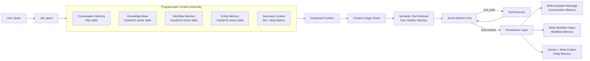
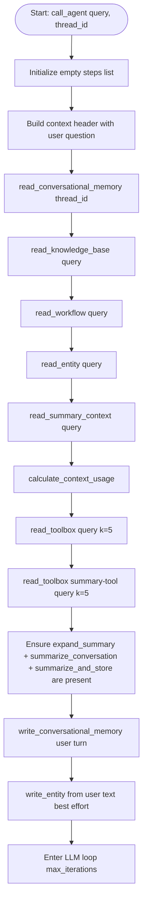
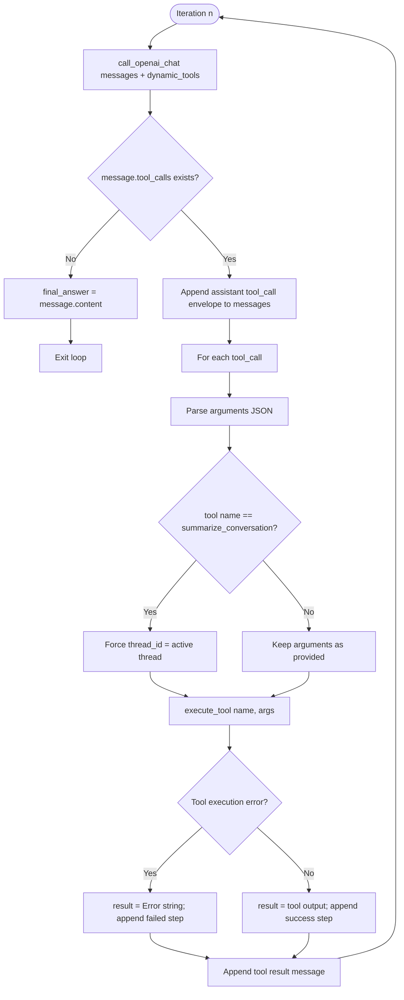
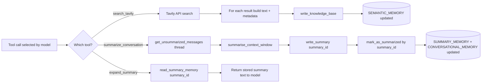
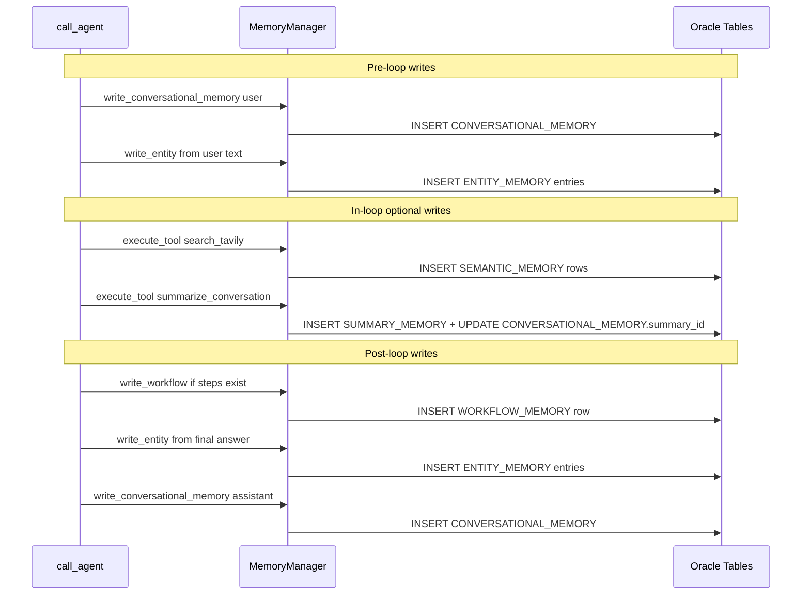
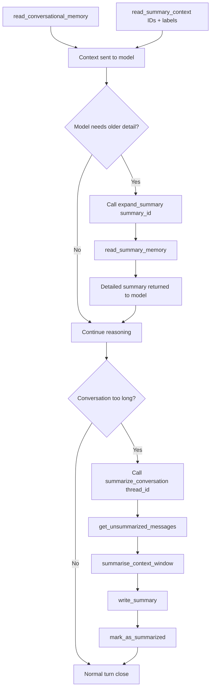
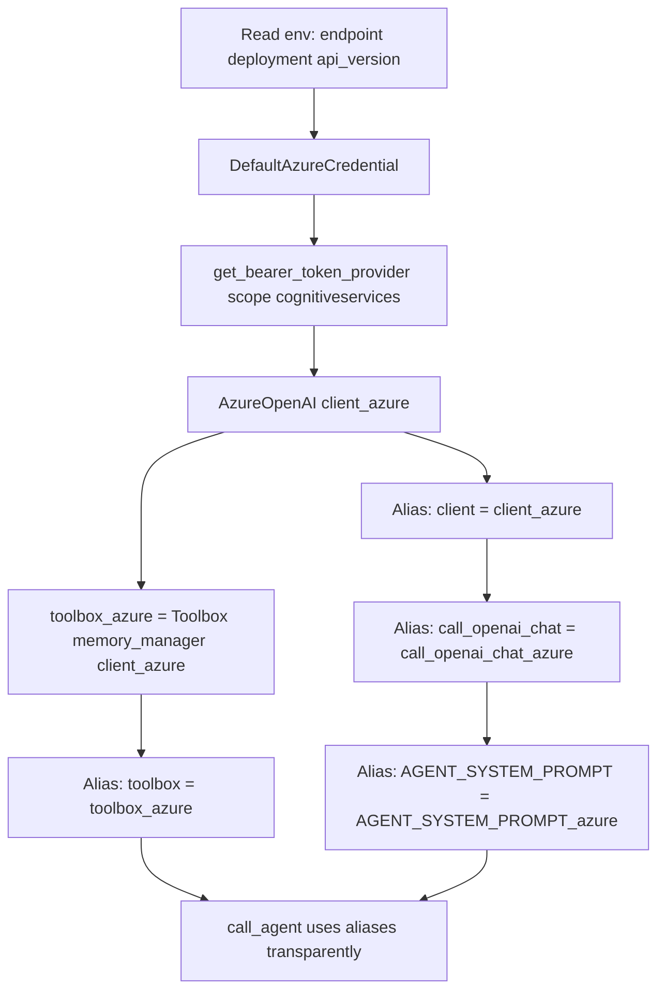

# Architecture Guide: memory_context_engineering_agents-fassis.ipynb

This document explains the architecture implemented in the notebook and how memory engineering + context engineering are combined into a production-style agent harness.

## 1. High-Level System Architecture

## 2. Request Lifecycle (Exact Function Order)

This is the exact runtime order in call_agent(query, thread_id).

## 3. Iteration Flow (Inside One Loop Turn)

This shows exactly what happens each iteration after the LLM response returns.

## 4. Tool Branches That Change State

Not all tools just return text. These three branches modify persistent memory state.

## 5. Persistence Timeline (When Each Table Is Written)

This timeline is useful to understand why the agent appears stateful across turns.

## 6. Context Compaction and Re-expansion

This is the practical mechanism that keeps context bounded without losing history.

## 7. Azure Request Path in This Notebook

This diagram maps the concrete aliasing approach used so downstream code stays unchanged.

## 8. Why This Architecture Works

- Reliability: memory load/save is deterministic and not left to model discretion.
- Scalability: semantic tool retrieval avoids passing large tool catalogs every turn.
- Continuity: conversation + summaries + entities preserve long-horizon state.
- Efficiency: context compaction and JIT expansion reduce token pressure.
- Learning behavior: web/tool outputs are persisted back into long-term memory.

---

If you want, this can be followed by a second document with a component-by-component mapping table from notebook cell numbers to architecture blocks.
